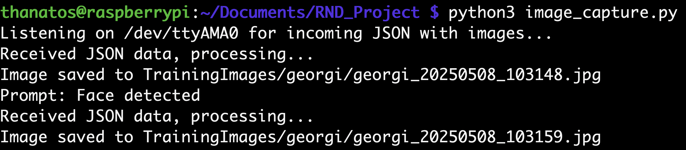
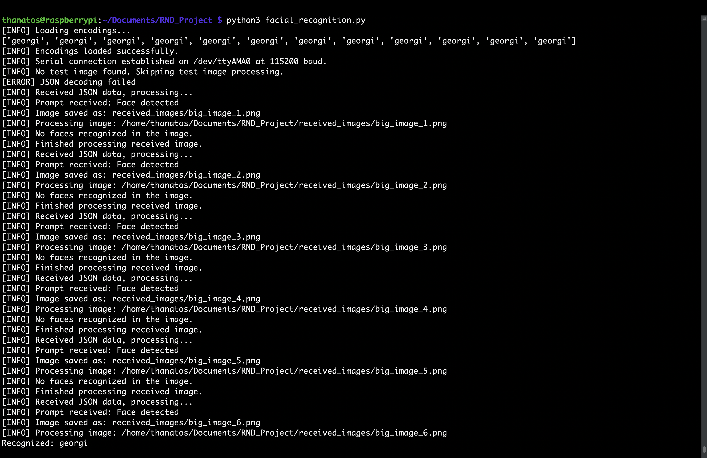

# 🧠 Watcher Face Recognition System

Integrated facial recognition system using Raspberry Pi and Seedstudio Watcher, designed for real-time face detection, training, and identification with LED indication.

---

## 📌 Table of Contents
- [Description](#description)
- [Requirements](#requirements)
- [Hardware Setup](#hardware-setup)
- [Software Installation](#software-installation)
- [Step-by-Step Process](#step-by-step-process)
- [Demo Video](#demo-video)
- [Project Structure](#project-structure)
- [Contact](#contact)

---

## 🧾 Description
This project is an autonomous system that:
- Captures images via the Seedstudio Watcher over a serial port.
- Saves and organizes images by name.
- Trains a face recognition model using the `face_recognition` library.
- Uses green/red LEDs to indicate recognition results.
- Handles real Base64 images and serial communication.

---

## ⚙️ Requirements

**Hardware:**
- Raspberry Pi (recommended: 3B+, 4)
- Seedstudio Watcher
- Connected green/red LEDs to GPIO (pins 23 and 24)

**Software / Libraries:**
```bash
pip install face_recognition imutils opencv-python numpy Pillow pyserial
```

---

## 🔧 Hardware Setup
1. Connect the Watcher to the Raspberry Pi via USB or UART.
2. Wire the LEDs:
   - Red: GPIO 24
   - Green: GPIO 23
3. Ensure `/dev/ttyAMA0` or `/dev/ttyACM0` is the active serial port.

---

## 💻 Software Installation
```bash
git clone https://github.com/YOUR_REPO_HERE.git
cd YOUR_REPO_HERE
```

---

## 🚀 Step-by-Step Process

### 1. Capture Images (`image_capture.py`)
```bash
python3 image_capture.py
```
- Starts listening to the serial port.
- Receives JSON with `big_image` → decodes and saves the image.
- Images are stored in `TrainingImages/<name>`.

### 2. Train Model (`model_training.py`)
```bash
python3 model_training.py
```
- Scans the `TrainingImages` folder.
- Extracts face encodings.
- Creates `encodings.pickle`.

### 3. Real-Time Recognition (`facial_recognition.py`)
```bash
python3 facial_recognition.py
```
- Listens for images via serial port.
- Recognizes faces and activates LED based on result.

---

## 🎥 Demo Video
📌 *[Add YouTube/Vimeo demo link here]*

---

## 📂 Project Structure
```
project/
├── image_capture.py
├── model_training.py
├── facial_recognition.py
├── TrainingImages/
│   └── <name>/
├── received_images/
├── encodings.pickle
└── README.md
```

---

## 📬 Contact
Developed by: [Your Name]  
Email: [email@example.com]  
Company: [If applicable]


---

## 🖼 Watcher Task Configuration

To configure a task on the Seedstudio Watcher device for face detection and serial image output:

### Step 1: Choose Face Detection Model


### Step 2: Set Output to UART with Base64 Image


### Step 3: Set Frequency and Runtime


---

## 📷 Sample Captures & Output

### Capturing Images via Serial Port


### Real-Time Facial Recognition


### Project File Structure on Raspberry Pi

